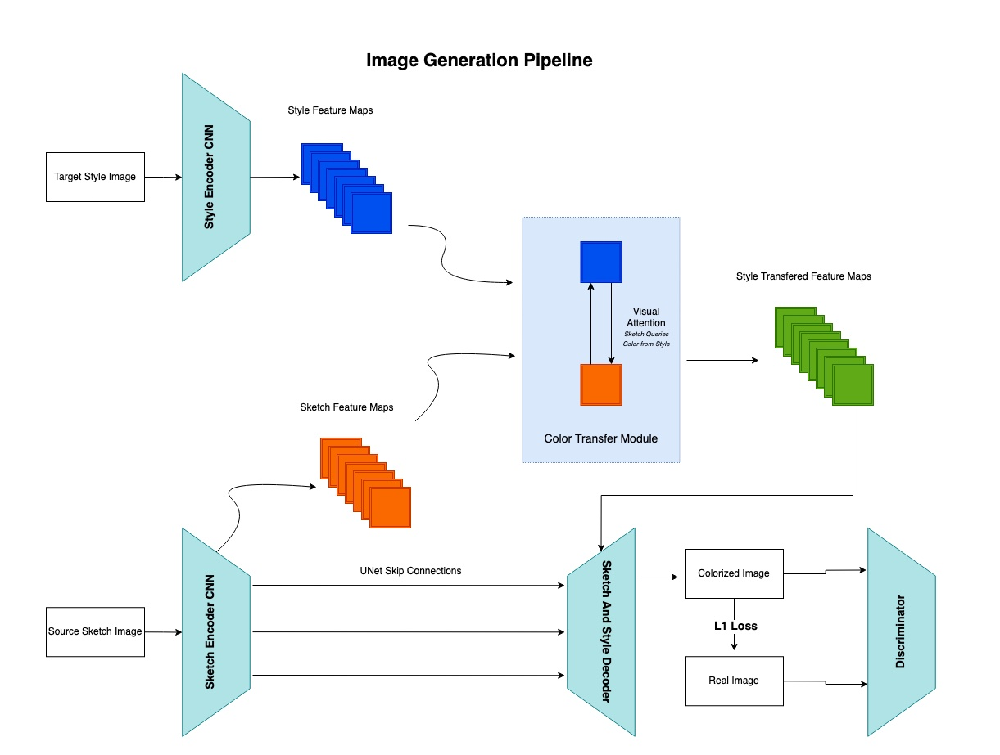
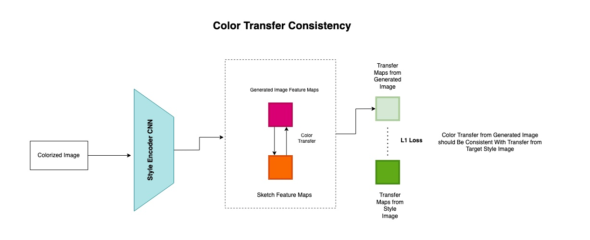

# Nerk

## Overview

The Nerk is a generative neural network that can colorize a facial portrait sketch by basing on an already colorized portrait. Essentailly, the network processes the sketch by transfering plausible colors from the exemplar to the uncolored sketch thus getting it painted the in the same style. With the Nerk, it is possible to try several styles of colorization for the same portrait within short very period of time. All you need is an examplar of how you need the sketch to be painted. Examples are provided in the samples section.

## Pipeline

The Nerk consists of several modules which enable exemplar based colorization.

1. Sketch Encoder: It is a UNet based CNN that extracts a low dimension representation from the input portrait sketch  
2. Style Encoder: It is a UNet based CNN that extracts a low dimension representation from the desired exemplar image
3. Color Transfer: This module transfers the colors from the exemplar portrait to the correct place in the sketch portrait. It is framed using visual attention over chennels of the bottlenecks from Sketch and Style encoders respectively. This module essentially learns a correspondence between facial parts of the sketch and exemplar and transfers the color in semantically coherent manner.
4. Decoder: This module is a UNet decoder that uspcales the output of the color transfer module to get the fineal image.

<b>Training Details</b>

The dataset of facial sketches was obtained from pubilcally available repository of art. It is called Danboroo 2019 faces dataset. To obtain sketches for the obtained facial portraits, binarization and edge detection filters were used with different parameters in order to obtain variety in the styles of sketches.  

Exemplars for each sketch were obtained using non linear thin plate spline transform which makes the color transfer pipeline self supervised. Essentially, the color was transfereed from a warped version of the ground truth image. This way, the network has to learn to transfer correct colors to the correct place in the sketch. In order to supervise the colorization, an L1 distance loss was used between ground truth image and the colorized version. Since the colors were transfered from a warped version of the original image, the output image is encouraged to be the same as the original image.  

Additionally, a discriminator network is trained to differentiate between fake colored and original images to obtain realistic output colors since L1 loss only obtains average grayish color. The task of the generative process is to improve the color that we get from L1 loss and shift the average color toward the color present in the original image. In test time however, instead of providing waped version of original images, we provide a colored exemplar which is has different face then the one in the sketch and the model transfers the color from exemplar to the sketch.  

In order to make sure that the generated image contains the same colors as the exemplar a consistency loss function is introduced in the pipeline. The loss enforces the consistency of color transfer from exemplar to sketch and from the generated image to the same sketch. The loss essentially enforces that if we transfer the color from the generated image to the sketch, we should get the same result as if we transfered the color from the exemplar to the sketch. This ensures that the exemplar image and the generated image are coherent in colors and style.  

<b>Samples</b>

Below are some exemplas of how the Nerk works. For the same sketch it is able to obtain multiple styles of painting by taking the colors from the exemplar image and transferring it to the sketch.

